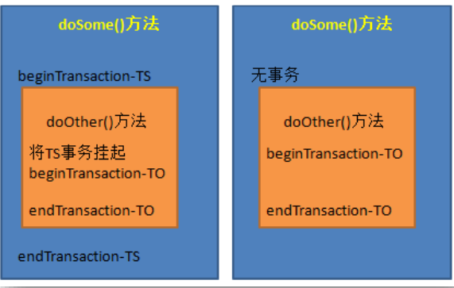

# 第1章 Spring 概述

## 1.1 Spring 框架是什么

> Spring 是于 2003 年兴起的一个轻量级的 Java 开发框架，它是为了解决企业应用开发 的复杂性而创建的。Spring 的核心是控制反转（IoC）和面向切面编程（AOP）。Spring 是可 以在 Java SE/EE 中使用的轻量级开源框架。

&emsp;Spring 的主要作用就是为代码“解耦”，降低代码间的耦合度。就是让对象和对象（模 块和模块）之间关系不是使用代码关联，而是通过配置来说明。即在 Spring 中说明对象（模 块）的关系。 

&emsp;Spring 根据代码的功能特点，使用 Ioc 降低业务对象之间耦合度。IoC 使得主业务在相互 调用过程中，不用再自己维护关系了，即不用再自己创建要使用的对象了。而是由 Spring 容器统一管理，自动“注入”,注入即赋值。 而 AOP 使得系统级服务得到了最大复用，且 不用再由程序员手工将系统级服务“混杂”到主业务逻辑中了，而是由 Spring 容器统一完成 “织入”

## 1.2 Spring 优点？

&emsp;Spring 是一个框架，是一个半成品的软件。有 20 个模块组成。它是一个容器管理对象， 容器是装东西的，Spring 容器不装文本，数字。装的是对象。Spring 是存储对象的容器.

**（1） 轻量**

&emsp;spring 框架使用的 jar 都比较小，一般在 1M 以下或者几百 kb。Spring 核心功能的所需 的 jar 总共在 3M 左右。 Spring 框架运行占用的资源少，运行效率高。不依赖其他 jar

**（2） 针对接口编程，解耦合** 

&emsp;Spring 提供了 Ioc 控制反转，由容器管理对象，对象的依赖关系。原来在程序代码中的 对象创建方式，现在由容器完成。对象之间的依赖解耦合。

**（3） AOP 编程的支持** 

&emsp;通过 Spring 提供的 AOP 功能，方便进行面向切面的编程，许多不容易用传统 OOP 实现 的功能可以通过 AOP 轻松应付 在 Spring 中，开发人员可以从繁杂的事务管理代码中解脱出来，通过声明式方式灵活地 进行事务的管理，提高开发效率和质量。

 **(4） 方便集成各种优秀框架** 

&emsp;Spring 不排斥各种优秀的开源框架，相反 Spring 可以降低各种框架的使用难度，Spring 提供了对各种优秀框架（如 Struts,Hibernate、MyBatis）等的直接支持。简化框架的使用。 Spring 像插线板一样，其他框架是插头，可以容易的组合到一起。需要使用哪个框架，就把 这个插头放入插线板。不需要可以轻易的移除。

## 1.3 Spring 体系结构


&emsp;Spring 由 20 多个模块组成，它们可以分为数据访问/集成（Data Access/Integration）、 Web、面向切面编程（AOP, Aspects）、提供JVM的代理（Instrumentation）、消息发送（Messaging）、 核心容器（Core Container）和测试（Test）  

# 第2章 IoC 控制反转  
&emsp;控制反转（IoC，Inversion of Control），是一个概念，是一种思想。指将传统上由程序代  
码直接操控的对象调用权交给容器，通过容器来实现对象的装配和管理。控制反转就是对对  
象控制权的转移，从程序代码本身反转到了外部容器。通过容器实现对象的创建，属性赋值，  
依赖的管理。    
&emsp;IoC 是一个概念，是一种思想，其实现方式多种多样。当前比较流行的实现方式是依赖  
注入。应用广泛。    
&emsp;依赖：classA 类中含有 classB 的实例，在 classA 中调用 classB 的方法完成功能，即 classA  
对 classB 有依赖。    
&emsp;Ioc 的实现：    
➢ 依赖注入：DI(Dependency Injection)，程序代码不做定位查询，这些工作由容器自行  
完成。  
&emsp;依赖注入 DI 是指程序运行过程中，若需要调用另一个对象协助时，无须在代码中创建  
被调用者，而是依赖于外部容器，由外部容器创建后传递给程序。  
Spring 的依赖注入对调用者与被调用者几乎没有任何要求，完全支持对象之间依赖关系  
的管理。    
&emsp;Spring 框架使用依赖注入（DI）实现 IoC。    
&emsp;Spring 容器是一个超级大工厂，负责创建、管理所有的 Java 对象，这些 Java 对象被称    
为 Bean。Spring 容器管理着容器中 Bean 之间的依赖关系，Spring 使用“依赖注入”的方式    
来管理 Bean 之间的依赖关系。使用 IoC 实现对象之间的解耦和。    
## 2.1第一个Spring工程

**(1)maven**

```
<dependency>
<groupId>org.springframework</groupId>
<artifactId>spring-context</artifactId>
<version>5.2.5.RELEASE</version>
</dependency>
插件
<build>
<plugins>
 <plugin>
 <artifactId>maven-compiler-plugin</artifactId>
 <version>3.1</version>
 <configuration>
 <source>1.8</source>
 <target>1.8</target>
 </configuration>
 </plugin>
</plugins>
</build>
```

**定义接口与实体类**

```
public interface SomeService {
void doSome();
}
public class SomeServiceImpl implements SomeService {
public SomeServiceImpl() {
super();
System.out.println("SomeServiceImpl无参数构造方法");
}
@Override
public void doSome() {
System.out.println("====业务方法doSome()===");
}
}
```

**创建 Spring 配置文件**

​	在 src/main/resources/目录现创建一个 xml 文件，文件名可以随意，但 Spring 建议的名称为 applicationContext.xml。

​	 spring 配置中需要加入约束文件才能正常使用，约束文件是 xsd 扩展名。

```
applicationContext.xml 8
 <?xml version="1.0" encoding="UTF-8"?>
 <beans xmlns="http://www. springframework.org/schema/beans"3
xmlns:xsi="http: //www.w3.org/2001/xMILSchema-instance"
xsi:schemaLocation="http:/ /www. springframework.org/schema/beans
http://www. springframework.org/schema/beans/spring-beans.xsd">
<!--注册bean对象id:自定义对象的名称,通过id在代码中使用对象class:类的全限定名称,不能是接口-->
<bean id="someService" class="com.bjpowernode. service.SomeServiceImpl”/>
 </beans>

```

<bean>：用于定义一个实例对象。一个实例对应一个 bean 元素。 id：该属性是 Bean 实例的唯一标识，程序通过 id 属性访问 Bean，Bean 与 Bean 间的依 赖关系也是通过 id 属性关联的。 class：指定该 Bean 所属的类，注意这里只能是类，不能是接口。

>spring是把创建好的对象放入到 map中, spring框架有一个map存放 对象的。 springMap.put( id的值，对象）; 例如springMap.put( "someservice",  new someserviceImpl())3 一个bean标签声明一个对象。

**使用 spring 创建非自定义类对象**

spring 配置文件加入 java.util.Date 定义： 

`<bean id="myDate" class="java.util.Date" />`

MyTest 测试类中：

 调用 getBean(“myDate”); 获取日期类对象。

## **2.2ApplicationContext 接口（容器）**

ApplicationContext 用于加载 Spring 的配置文件，在程序中充当“容器”的角色。其实现 类有两个。


**A、配置文件在类路径下**

若 Spring 配置文件存放在项目的类路径下，则使用 ClassPathXmlApplicationContext 实现 类进行加载。

```
Test
public void test02(){
	//spring配置文件在类路径下( clas.spath)
	string resource="applicationContext.xml";/创建spring容器对象
	ApplicationContext ac = new ClassPathXmlApplicationContext(resource);从spring容器中获取对象,使用id
	SomeService service = (SomeService) ac.getBean("someService");service.doSome();
}

```

**B、 ApplicationContext 容器中对象的装配时机**

​	ApplicationContext 容器，会在容器对象初始化时，将其中的所有对象一次性全部装配好。 以后代码中若要使用到这些对象，只需从内存中直接获取即可。执行效率较高。但占用内存

```
// ApplicationContext容器对对象的装配时机@Test
public void testo7() {
	//获取容器:此时容器中的所有对象均已装配完毕ApplicationContext context=new ClassPathXm1ApplicationContext("applicationContext.xml");
}
```

**C、 使用 spring 容器创建的 java 对象**


## 2.3 基于 XML 的 DI

### 2.3.1 注入分类

​	 bean 实例在调用无参构造器创建对象后，就要对 bean 对象的属性进行初始化。初始化 是由容器自动完成的，称为注入。 根据注入方式的不同，常用的有两类：set 注入、构造注入。

**（1） set 注入(掌握)** 

set 注入也叫设值注入是指，通过 setter 方法传入被调用者的实例。这种注入方式简 单、直观，因而在 Spring 的依赖注入中大量使用。

A、简单类型

```
public class Student {
	private String name;private int age;
	//setter
	//tostring()
}
```

```
<bean id="myStudent" class="com.bjpowernode.ba01.Student">
<!--简单类型的属性赋值-->
<property name="name" value="张三”/><!-- setName("张三")--><property name="age " value="20”/><! -- setAge(20) -->
</bean>
```

```
@Test
public void test01(){
	string configLocation="com/bjpowernode/bao1/applicationContext.xml";
	ApplicationContext ctx = new ClassPathXm1ApplicationContext(configLocation);Student student = (Student) 	ctx.getBean( "myStudent");
	System.out.print1n("student: "+student);
}
```

创建 java.util.Date 并设置初始的日期时间：

Spring 配置文件：

```
bean id="myDate" class="java.utiL.Date">
<! --设置时间是2019-01-16 21:51:40 -->
<property name="time" value="1547646700353”/>/bean>
```

```
@Test
public void test02(){
String configLocation="applicationContext.xm1";
	ApplicationContext ctx = new classPathXmlApplicationContext(configLocation);
	Date date = (Date) ctx.getBean( "myDate" );
	system.out.print1n(date);
}
```

B、 引用类型

​	当指定 bean 的某属性值为另一 bean 的实例时，通过 ref 指定它们间的引用关系。ref 的值必须为某 bean 的 id 值。

```
public class student {
	private string name;private int age;
	private schooi schooi;
	//setter
	//toString()
}
```

```
<!--声明School对象–->
<bean id="mySchool" class="com.bjpowernode.ba02.School">
<property name="name" value="北京大学”/>
<property name="address" value="北京的海淀区”/>/ bean>
```

**对于其它 Bean 对象的引用，使用标签的 ref 属性**

```
<!--语法格式1:使用ref作为属性-->
<bean id="myStudent" class="com.bjpowernode.ba02.Student">
<!--简单类型的属性赋值↓->
<property name="name" value="张三”><!-- setName("张三") --><property name="age" value="20”/><! -- setAge(20) -->
<!--`引用类型的属性赋值–->
<property name="school" ref="mySchool"/> 〈!-- setSchool(mySchool) -->/bean>

```

测试方法

```
Test
public void test01(){
	String configLocation="com/bjpowernode/ba02/applicationContext.xml";
	ApplicationContext ctx = new ClassPathXm1ApplicationContext(configLocation);
	Student student = (Student) ctx.getBean("myStudent");
	System.out.print1n( "student: "+student);
}
```

**（2） 构造注入(理解)**

​	构造注入是指，在构造调用者实例的同时，完成被调用者的实例化。即，使用构造器设置依赖关系。

​	举例 1：

```
/**
*有参数构造方法*/
public student(String myname,int myage，School myXueXiao){
System.out.print1n( "student的有参数构造方法");
this.name = myname;
this.age = myage;
this.school= myXueXiao;
}
```

```
<bean id="myStudent" class="com.bjpowernode.ba03.Student">
<constructor-arg name= "myage" value="22”/>
<constructor-arg name="myname" value="李四”/>
<constructor-arg name="myXueXiao" ref="mySchool”/></bean>
```

标签中用于指定参数的属性有：

 ➢ name：指定参数名称。 

➢ index：指明该参数对应着构造器的第几个参数，从 0 开始。不过，该属性不要也行， 但要注意，若参数类型相同，或之间有包含关系，则需要保证赋值顺序要与构造器中的参数 顺序一致。

举例 2：

​	使用构造注入创建一个系统类 File 对象

```
bean id="myFile" class="java.io.File"><! --创建一个File对象,表示pom.xml -->
<constructor-arg name="parent" value="E:/course8/02-di-xml”/><constructor-arg name="child" value="pom. xml”/>
</bean>
```

测试类

```
public void testFile( {
	String configLocation="applicationContext.xm1";ApplicationContext ctx =
	new ClassPathXm1ApplicationContext(configLocation);
	File file = (File) ctx.getBean( "myFile" );
	System.out.print1n("文件路径:"+file.getAbsolutePath());System.out.println( "文件名称:"+file.getName());
}
```

### 2.3.2 引用类型属性自动注入

​	对于引用类型属性的注入，也可不在配置文件中显示的注入。可以通过为标签 设置 autowire 属性值，为引用类型属性进行隐式自动注入（默认是不自动注入引用类型属 性）。根据自动注入判断标准的不同，可以分为两种：

 byName：根据名称自动注入 

byType： 根据类型自动注入

**（1） byName 方式自动注入**

​	当配置文件中被调用者 bean 的 id 值与代码中调用者 bean 类的属性名相同时，可使用 byName 方式，让容器自动将被调用者 bean 注入给调用者 bean。容器是通过调用者的 bean 类的属性名与配置文件的被调用者 bean 的 id 进行比较而实现自动注入的。

```
public class Student {
	private String name;
	private int age; llInteger
	//定义引用类型
	private School ;chool;
}
public class School{
	private String name;
}
```

```
<!--声明School对象–->
<bean id="school" class="com.bjpowernode.ba04.School">
<property name="name" value="北京大学”/>
<property name="address" value="北京的海惋区”/>
</bean>

<bean id="myStudent" class="com.bjpowernode. ba04.Student" autowire="byName">
	<!--简单类型的属性赋值–->
	<property name="name" value="张三”/>
	<property name="age" value="20”/><!--引用类型的属性赋值–->
    <--	 <property name="school" ref="mySchool"/> -->
     <--注意这里的引用类型已经被注掉了，写上autowire就不需要自己写properties了-->
</bean>
```

```
Test
public void test01(){
	string configLocation="com/bjpowernode/ba04/applicationContext.xml";ApplicationContext ctx, =
	new ClassPathXm1ApplicationContext(configLocation);
	Student student = (Student) ctx.getBean("myStudent");
	System.out.print1n( "student: "+student);
}
```

**（2） byType 方式自动注入**

​	使用 byType 方式自动注入，要求：配置文件中被调用者 bean 的 class 属性指定的类， 要与代码中调用者 bean 类的某引用类型属性类型同源。即要么相同，要么有 is-a 关系（子 类，或是实现类）。但这样的同源的被调用 bean 只能有一个。多于一个，容器就不知该匹配 哪一个了。

```
<bean id="myStudent" class="com.bjpowernode. ba04.Student" autowire="byType">
	<!--简单类型的属性赋值–->
	<property name="name" value="张三”/>
	<property name="age" value="20”/><!--引用类型的属性赋值–->
    <--	 <property name="school" ref="mySchool"/> -->
     <--注意这里的引用类型已经被注掉了，写上autowire就不需要自己写properties了-->
</bean>
```

### 2.3.3 为应用指定多个 Spring 配置文件

​	在实际应用里，随着应用规模的增加，系统中 Bean 数量也大量增加，导致配置文件变 得非常庞大、臃肿。为了避免这种情况的产生，提高配置文件的可读性与可维护性，可以将 Spring 配置文件分解成多个配置文件。

 **包含关系的配置文件：** 	

​	多个配置文件中有一个总文件，总配置文件将各其它子文件通过引入。在 Java代码中只需要使用总配置文件对容器进行初始化即可。 加载一个总的，可以包含所有 引用 举例： 代码：

> "classpath:”表示类路径( class文件所 在的目录)，在spring的配置文件中 要指定其他文件的位置，需要使用 classpath ,告诉spring到哪去加载读 取文件。

Spring 配置文件：

```
<import resource="classpath:com/bjpowernode/ba06/spring-school.xml" />
<import resource="classpath:com/bjpowernode/ba06/spring-student.xml"/>
```

​	也可使用通配符*。但，此时要求父配置文件名不能满足*所能匹配的格式，否则将出 现循环递归包含。就本例而言，父配置文件不能匹配 spring-*.xml 的格式，即不能起名为 spring-total.xml。 因为配置成这样，会导致自己引用自己，芭比Q。

<! --包含关系中可以使用通配*,表示任意个字符注意:总的配器文件（total.xml〉名称不能包含在通配符的范围内，不能叫spring-total.xm1-->
<import resource="cLasspath:com/bjpowernode/ba06/spring-*.xml"/>

测试代码：

```
@Test
public void testo1(){
String configLocation="com/bjpowernode/ba06/total.xml";
ApplicationContext ctx = new ClassPathXm1Applicationcontext(configLocation);
Student student = (Student) ctx.getBean( "myStudent");
system.out.print1n( "student: "+student);
}
```

## 2.4 基于注解的 DI

​	对于 DI 使用注解，将不再需要在 Spring 配置文件中声明 bean 实例。Spring 中使用注解， 需要在原有 Spring 运行环境基础上再做一些改变。

​	需要在 Spring 配置文件中配置组件扫描器，用于在指定的基本包中扫描注解。

```
<?xml version="1.0" encoding="UTF-8"?>
<beans xmlns="http: //www. springframework.org/schema/beans"
xmlns:xsi="http: //www.w3.org/2001/XMLSchema-instance"
xm1ns:context="http: //www.springframework.org/schema/context"xsi:schemaLocation="
http :/ / www.springframework.org/schema/beans
http:/ /www.springframework.org/schema/beans/spring-beans.xsdhttp: //www. springframework.org/schema/ context
http://www. springframework.org/schema/context/spring-context.xsd"><!--声明组件扫描器( component-scan):指定注解所在的包名-->
<context:component-scan base-package="com.bjpowernode.ba01" /></beans>
```

指定多个包的三种方式：

 1)使用多个 context:component-scan 指定不同的包路径

```
<context:component-scan base-package="com.bjpowernode.beans”/>
<context:component-scan base-package="com.bjpowernode.vo”/>
```

2)指定 base-package 的值使用分隔符

 分隔符可以使用逗号（，）分号（；）还可以使用空格，不建议使用空格。

 逗号分隔：

```
<context: component-scan base-package="com.bjpowernode.beans, cm.bjpowernode.vo”/>
```

分号分隔：

```
<context:component-scan base-package="com.bjpowernode.bears; com.bjpowernode.vo”/>
```

3)base-package 是指定到父包名

base-package 的值表是基本包，容器启动会扫描包及其子包中的注解，当然也会扫描到 子包下级的子包。所以 base-package 可以指定一个父包就可以。

```
<context : component-scan base-package= "com. bjpowernode" />
或者最顶级的父包
<context : component-scan base-package= "com/>
```

**<u>但不建议使用顶级的父包，扫描的路径比较多，导致容器启动时间变慢。</u>**指定到目标包和 合适的。也就是注解所在包全路径。例如注解的类在 com.bjpowernode.beans 包中

```
<context: component-scan base-package="com.bjpowernode.beans”/>
```

### 2.4.1 定义 Bean 的注解@Component(掌握)

需要在类上使用注解@Component，该注解的 value 属性用于指定该 bean 的 id 值。 举例：di01

```
//注解参数中省略了value属性，该属性用于指定Bean的id
@component( "mystudent")
public class student {
	private string name;
	private int age;
}
```

另外，Spring 还提供了 3 个创建对象的注解：

 ➢ @Repository 用于对 DAO 实现类进行注解 

➢ @Service 用于对 Service 实现类进行注解 

➢ @Controller 用于对 Controller 实现类进行注解

​	这三个注解与@Component 都可以创建对象，但这三个注解还有其他的含义，**@Service 创建业务层对象，业务层对象可以加入事务功能，@Controller 注解创建的对象可以作为处 理器接收用户的请求。**

​	 @Repository，@Service，@Controller 是对@Component 注解的细化，标注不同层的对 象。即持久层对象，业务层对象，控制层对象。

<u>@Component 不指定 value 属性，bean 的 id 是类名的首字母小写。</u>

```
@Component
public class Student 
```

```
String configLocation = "applicationContext.xml";
ApplicationContext ac = new ClassPathXmlApplicationContext(configLocation);Student student = (Student) ac.getBeari( "student");
```

### 2.4.2 简单类型属性注入@Value(掌握) 

​	需要在属性上使用注解@Value，该注解的 value 属性用于指定要注入的值。 使用该注解完成属性注入时，类中无需 setter。当然，若属性有 setter，则也可将其加到 setter 上。 举例

```
//注解参数中省略了value属性,该属性用于指定Bean的i
d@component( "myStudent")
public class student i
@value(“张三")
private string name;@value("21")
private int age;
@override
public string toString() i
return "Student [name=" + name + ", age=" + age + "]";
}
}
```

2.4.3 byType 自动注入@Autowired(掌握)

​		需要在引用属性上使用注解@Autowired，该注解默认使用**按类型自动装配 Bean 的方式**。 使用该注解完成属性注入时，类中无需 setter。当然，若属性有 setter，则也可将其加 到 setter 上。 举例：

```
@component( "mySchoo1")
public class schoo1 {
	@value("清华大学")
	private string name;
}


@component( "myStudent")
public class Student {
	@value("张三")
	private String name;
	@value( "21")
	private int age);
	@Autowired
	private Schoolschool;
}

```

### 2.4.4 byName 自动注入@Autowired 与@Qualifier(掌握)

​	 需要在引用属性上联合使用注解@Autowired 与@Qualifier。@Qualifier 的 value 属性用 于指定要匹配的 Bean 的 id 值。类中无需 set 方法，也可加到 set 方法上。

举例：


```
@component("mySchoo1")
public class Schoo1 {
	@Value("清华大学")
	private String name;
}

@component( "mystudent")
public class student {
	@value("张三")
	private string name;value( "21")
	private int age;
	@Autowired
	@Qualifier("myschoo1")
	private school school;
}

```

@Autowired 还有一个属性 required，默认值为 true，<u>表示当匹配失败后，会终止程序运 行。若将其值设置为 false，则匹配失败，将被忽略，未匹配的属性值为 null。</u>

### 2.4.5 JDK 注解@Resource 自动注入(掌握)

​	Spring提供了对 jdk中@Resource注解的支持。@Resource 注解既可以按名称匹配Bean， 也可以按类型匹配 Bean。默认是按名称注入。使用该注解，要求 JDK 必须是 6 及以上版本。 @Resource 可在属性上，也可在 set 方法上。


**（1） byType 注入引用类型属性**

​	<u>@Resource 注解若不带任何参数，采用默认按名称的方式注入，按名称不能注入 bean， 则会按照类型进行 Bean 的匹配注入。</u>

 举例：

```
@Component( "mySchool")public class schoo1{
	@value(“清华大学")
	private String name;
}

@Component( "mystudent")public class Student {
	@Value("张三")
	private String name;
	@Value( "21")
	private int age;
	@Resource
	private schoolschool;
}
```

**（2） byName 注入引用类型属性**

​	@Resource 注解指定其 name 属性，则 name 的值即为按照名称进行匹配的 Bean 的 id。

​	举例：

```
@component("myschool")
public class schoo1 {
	@Value("清华大学")
	private string name;
}
public class student {
	@vaiue("张三")
	private string name;value( "21")
	private int age;
	@Resource( name= "myschool")
	private school schoo1;
}
```

`个人观点： @Resource( name= "myschool")=@Autoware@Qualifier("myschoo1")   @Resource=@Autoware`

### 2.4.6 注解与 XML 的对比

注解优点是： 

⚫ 方便

 ⚫ 直观

 ⚫ 高效（代码少，没有配置文件的书写那么复杂）。 其

**弊端也显而易见：以硬编码的方式写入到 Java 代码中，修改是需要重新编译代码的。**

------

 XML 方式优点是： 

⚫ 配置和代码是分离的 

⚫ 在 xml 中做修改，无需编译代码，只需重启服务器即可将新的配置加载。

 xml 的缺点是：编写麻烦，效率低，大型项目过于复杂。

# 第3章AOP 面向切面编程

## 3.1不使用 AOP 的开发方式（理解）

Step1：项目 aop_leadin1

​	 先定义好接口与一个实现类，该实现类中除了要实现接口中的方法外，还要再写两个非 业务方法。非业务方法也称为交叉业务逻辑： 

➢ doTransaction()：用于事务处理 

➢ doLog()：用于日志处理

 然后，再使接口方法调用它们。接口方法也称为主业务逻辑。 接口：

```
public interface SomeService {
	void dosome();
	void do0ther();
}	
```

```
public class SomeServiceImpl implements SomeService {
	@Override
	public void doSome() {
		doLog();
		System.out.print1n("执行了业务方法doSome" );doTrans()3
	}
	@Override
	public void doother() {
		doLog();
		System.out.print1n("执行了业务方法doother" );doTrans();
	}
	public void doLog(){
		System.out.println("非业务功能，日志功能，在方法开始时渝出日志
	}
	public void doTrans(){
		System.out.print1n("非业务事务功能，在业务方法执行之后，加入事务");
	}
}
```

Step2：项目 aop_leadin2 

​	当然，也可以有另一种解决方案：将这些交叉业务逻辑代码放到专门的工具类或处理类 中，由主业务逻辑调用

```
public class ServiceTools {
public static void doLog(){
system.out.print1n("非业务功能，日志功能，在方法开始时输出日志");
}
public static void doTrans(){
System.out.print1n(“非业务事务功能，在业务方法执行之后，加入事务");
}
```

```
public class SomeserviceImpl implements SomeService {
	@override
	public void dosome() {
		ServiceTools.doLog;
		System.out.print1n("执行了业务方法doSome" );serviceTools.doTrans();
	}
	@Override
	public void doother() {
		ServiceTools.doLog);
		System.out.print1n("执行了业务方法do0ther" );serviceTools.doTrans();
	}
}
```

```
public class SomeserviceImpl implements SomeService {
	@Override
	public void dosome() {
		ServiceTools.doLog();
		System.out.print1n("执行了业务方法doSome" );serviceToois.doTrans();
	}
	@Override
	public void doother() {
		ServiceTools.doLog();
		System.out.print1n("执行了业务方法do0ther" );serviceTools.doTrans();
}
```

Step3：项目 aop_leadin3 

以上的解决方案，还是存在弊端：交叉业务与主业务深度耦合在一起。当交叉业务逻辑 较多时，在主业务代码中会出现大量的交叉业务逻辑代码调用语句，大大影响了主业务逻辑 的可读性，降低了代码的可维护性，同时也增加了开发难度。

 所以，可以采用动态代理方式。在不修改主业务逻辑的前提下，扩展和增强其功能。 功能增强

```
public class MyInvocationHandler implements InvocationHandler {
	private 0bject target;
	public MyInvocationHandler(object target) i
		super();
		this.target = target;
	}
	public MyInvocationHandler(){
		super();	
	}
	@Override
	public 0bject invoke(Object proxy，Method method，0bject[] args)throws Throwable {
		object obj = null;
		//在方法之前输出日志ServiceTools.doLog();
		//执行目标方法,执行target对象的方法
		obj = method.invoke(target, args);// doSome
		//在方法之后，执行事务
		serviceTools.doTrans();/目标方法的执行结果
		return obj;
	}
}

```

````
public class MyTest {
	public static void main(String[ ] args) {
		//创建代理对象
		SomeService target = new SomeServiceImpl();
		MyInvocationHandler handler = new MyInvocationHandler(target);SomeService proxy = (SomeService) 			Proxy.newProxyInstance(
		target.getClass().getClassLoader(),target.getClass().getInterfaces(),handler);
		//通过代理对象执行业务方法，实现日志，事务的增强proxy.doSome();
		proxy.doother();
}
````

## 3.2AOP 概述

## 3.3AOP 简介

AOP（Aspect Orient Programming），面向切面编程。面向切面编程是从动态角度考虑程 序运行过程。

 AOP 底层，就是采用动态代理模式实现的。采用了两种代理：JDK 的动态代理，与 CGLIB 的动态代理。

> AOP 为 Aspect Oriented Programming 的缩写，意为：面向切面编程，可通过运行期动态代理实现程序功能的统一维护的一种技术。AOP 是 Spring 框架中的一个重要内容。利用 AOP 可以对业务逻辑的各个部分进行隔离，从而使得业务逻辑各部分之间的耦合度降低，提高程 序的可重用性，同时提高了开发的效率。

面向切面编程，就是将交叉业务逻辑封装成切面，利用 AOP 容器的功能将切面织入到 主业务逻辑中。所谓交叉业务逻辑是指，通用的、与主业务逻辑无关的代码，如安全检查、 事务、日志、缓存等。 若不使用 AOP，则会出现代码纠缠，即交叉业务逻辑与主业务逻辑混合在一起。这样， 会使主业务逻辑变的混杂不清。 例如，转账，在真正转账业务逻辑前后，需要权限控制、日志记录、加载事务、结束事 务等交叉业务逻辑，而这些业务逻辑与主业务逻辑间并无直接关系。但，它们的代码量所占 比重能达到总代码量的一半甚至还多。它们的存在，不仅产生了大量的“冗余”代码，还大 大干扰了主业务逻辑---转账。

## 3.4面向切面编程对有什么好处？

 1.减少重复； 2.专注业务； 注意：面向切面编程只是面向对象编程的一种补充。

**使用 AOP 减少重复代码，专注业务实现**


## 3.5AOP 编程术语(掌握) 

**（1） 切面（Aspect）** 

切面泛指交叉业务逻辑。上例中的事务处理、日志处理就可以理解为切面。常用的切面 是通知（Advice）。实际就是对主业务逻辑的一种增强。

 **（2） 连接点（JoinPoint）** 

连接点指可以被切面织入的具体方法。通常业务接口中的方法均为连接点。 

**（3） 切入点（Pointcut）** 

切入点指声明的一个或多个连接点的集合。通过切入点指定一组方法。 被标记为 final 的方法是不能作为连接点与切入点的。因为最终的是不能被修改的，不 能被增强的。 

**（4） 目标对象（Target）** 

目 标 对 象 指 将 要 被 增 强 的 对 象 。 即 包 含 主 业 务 逻 辑 的 类 的 对 象 。 上 例 中 的 StudentServiceImpl 的对象若被增强，则该类称为目标类，该类对象称为目标对象。当然， 不被增强，也就无所谓目标不目标了。 

**（5） 通知（Advice）** 

通知表示切面的执行时间，Advice 也叫增强。上例中的 MyInvocationHandler 就可以理 解为是一种通知。换个角度来说，通知定义了增强代码切入到目标代码的时间点，是目标方 法执行之前执行，还是之后执行等。通知类型不同，切入时间不同。 切入点定义切入的位置，通知定义切入的时间。

## 3.6AspectJ 对 AOP 的实现(掌握)

对于 AOP 这种编程思想，很多框架都进行了实现。Spring 就是其中之一，可以完成面向 切面编程。然而，AspectJ 也实现了 AOP 的功能，且其实现方式更为简捷，使用更为方便， 而且还支持注解式开发。所以，Spring 又将 AspectJ 的对于 AOP 的实现也引入到了自己的框 架中。

 在 Spring 中使用 AOP 开发时，一般使用 AspectJ 的实现方式。

AspectJ 简介

`AspectJ 是一个优秀面向切面的框架，它扩展了 Java 语言，提供了强大的切面实现。`

官网地址：http://www.eclipse.org/aspectj/ AspetJ 是 Eclipse 的开源项目，官网介绍如下：

> aspectj is
> a seamless aspect-oriented extension to the ]avatmprogramming language
> java platform compatibl
> eeasy to learn and use


a seamless aspect-oriented extension to the Javatm programming language（一种基于 Java 平台 的面向切面编程的语言）

 Java platform compatible（兼容 Java 平台，可以无缝扩展）

 easy to learn and use（易学易用）

### 3.6.1 AspectJ 的通知类型(理解)

AspectJ 中常用的通知有五种类型： 

（1）前置通知

 （2）后置通知 

**（3）环绕通知** 

（4）异常通知 

**（5）最终通知**

### 3.6.2 AspectJ 的切入点表达式(掌握)

AspectJ 定义了专门的表达式用于指定切入点。表达式的原型是：

`execution(modifiers-pattern? ret-type-pattern  declaring-type-pattern?name-pattern(param-pattern) throws-pattern?)`.

解释：

 modifiers-pattern] 访问权限类型

 ret-type-pattern 返回值类型 

declaring-type-pattern 包名类名 

name-pattern(param-pattern) 方法名(参数类型和参数个数) 

throws-pattern 抛出异常类型 

？表示可选的部分

以上表达式共 4 个部分。 execution(访问权限 方法返回值 方法声明(参数) 异常类型)

 切入点表达式要匹配的对象就是目标方法的方法名。所以，execution 表达式中明显就 是方法的签名。注意，表达式中黑色文字表示可省略部分，各部分间用空格分开。在其中可 以使用以下符号：

| 符号 | 意义                                                         |
| ---- | ------------------------------------------------------------ |
| *    | 0至多个任意字符                                              |
| ..   | 用在方法参数中，表示任意多个参数用<br>在包名后，表示当前包及其子包路径 |
| +    | 用在类名后，表示当前类及其子类<br/>用在接口后，表示当前接口及其实现类 |

举例：

 execution(public * *(..))  指定切入点为：任意公共方法。*

execution(* set*(..))  指定切入点为：任何一个以“set”开始的方法。*

execution(* com.xyz.service.*.*(..))  指定切入点为：定义在 service 包里的任意类的任意方法。

 execution(* com.xyz.service..*.*(..)) 指定切入点为：定义在 service 包或者子包里的任意类的任意方法。“..”出现在类名中时，后面必		须跟“*”，表示包、子包下的所有类。*

execution(* *..service.*.*(..)) 指定所有包下的 serivce 子包下所有类（接口）中所有方法为切入点 *

execution(* *.service.*.*(..)) 指定只有一级包下的 serivce 子包下所有类（接口）中所有方法为切入点 *

execution(* *.ISomeService.*(..)) 指定只有一级包下的 ISomeSerivce 接口中所有方法为切入点

 execution(* *..ISomeService.*(..)) 指定所有包下的 ISomeSerivce 接口中所有方法为切入点 

execution(* com.xyz.service.IAccountService.*(..))  指定切入点为：IAccountService 接口中的任意方法。 *

execution(* com.xyz.service.IAccountService+.*(..))  指定切入点为：IAccountService 若为接口，则为接口中的任意方法及其所有		实现类中的任意 方法；若为类，则为该类及其子类中的任意方法。 *

execution(* joke(String,int))) 指定切入点为：所有的 joke(String,int)方法，且 joke()方法的第一个参数是 String，第二个参 数是 		int。如果方法中的参数类型是 java.lang 包下的类，可以直接使用类名，否则必须使用 全限定类名，如 joke( java.util.List, int)。 

execution(* joke(String,*)))  指定切入点为：所有的 joke()方法，该方法第一个参数为 String，第二个参数可以是任意类 型，如		     		joke(String s1,String s2)和joke(String s1,double d2)都是，但joke(String s1,double d2,String  s3)不是。

execution(* joke(String,..)))  指定切入点为：所有的 joke()方法，该方法第一个参数为 String，后面可以有任意个参数且 参数类型不限，如 joke(String s1)、joke(String s1,String s2)和 joke(String s1,double d2,String s3) 都是。

 execution(* joke(Object)) 指定切入点为：所有的 joke()方法，方法拥有一个参数，且参数是 Object 类型。joke(Object ob) 是，但，joke(String s)与 joke(User u)均不是。

 execution(* joke(Object+)))  指定切入点为：所有的 joke()方法，方法拥有一个参数，且参数是 Object 类型或该类的子类。 不仅 joke(Object ob)是，joke(String s)和 joke(User u)也是。

### 3.6.3 AspectJ 的开发环境(掌握)

```
<dependency>
	<groupId>junit</groupId>
	<artifactId>junit</artifactId>
	<version>4.11</version>
	<scope>test</scope>
</dependency>
<dependency>
	<groupId>org.springframework</groupId>
	<artifactId>spring-context</artifactId>
	<version>5.2.5.RELEASE</version>
</dependency>
<dependency>
	<groupId>org.springframework</groupId>
	<artifactId>spring-aspects</artifactId>
	<version>5.2.5.RELEASE</version>
</dependency>
插件
<build>
<plugins>
 	<plugin>
	 <artifactId>maven-compiler-plugin</artifactId>
	 <version>3.1</version>
<configuration>
	 <source>1.8</source>
 	<target>1.8</target>
</configuration>
	</plugin>
</plugins>
</build>
```

**（2） 引入 AOP 约束**

在 AspectJ 实现 AOP 时，要引入 AOP 的约束。配置文件中使用的 AOP 约束中的标签， 均是 AspectJ 框架使用的，而非 Spring 框架本身在实现 AOP 时使用的。

 AspectJ 对于 AOP 的实现有注解和配置文件两种方式，常用是注解方式。

### 3.6.4 AspectJ 基于注解的 AOP 实现(掌握) 

AspectJ 提供了以注解方式对于 AOP 的实现。

（1） 实现步骤

 A、Step1：定义业务接口与实现类

```
public interface someService {
	void dosome(String name，int age);
}
```

```
public class SomeServiceImpl implements SomeService {
@Override
public void dosome(String name, int age) {
	System.out.print1n("执行了业务方法doSome" ) ;
}
```

B、 Step2：定义切面类

类中定义了若干普通方法，将作为不同的通知方法，用来增强功能。

```
/**
*@Aspect:是aspectj框架的注解,表示当前类是切面类*/
@Aspect
public class MyAspect i
	/*
	*@Before:前置通知
	*属性: value切入点表达式,表示切面执行的位置*位置:方法的定义上面
	*/
	@Before(value="execution(* com.bjpowernode.ba01.SomeServiceImpl.doSome(..))")
	public void myBefore()i
		//就是切面代码的功能,例如日志的输出,事务的处理
		System.out.println("前置通知:在目标方法之前先执行，例如输出日志");
		}
}
```

C、 Step3：声明目标对象切面类对象

```
<!--声明目标类对象-->
<bean id="someServiceTarget" class="com.bjpowernode.ba01.SomeServiceImpl" />
<!--声明切面类对象-->
<bean id="myAspect" class="com.bjpowernode.ba01.MyAspect”/>
```

D、Step4：注册 AspectJ 的自动代理

在定义好切面 Aspect 后，需要通知 Spring 容器，让容器生成“目标类+ 切面”的代理 对象。这个代理是由容器自动生成的。只需要在 Spring 配置文件中注册一个基于 aspectj 的 自动代理生成器，其就会自动扫描到@Aspect 注解，并按通知类型与切入点，将其织入，并 生成代理。

```
<!--声明目标类对象-->
<bean id="someServiceTarget" class="com.bjpowernode.ba01.SomeServiceImpl”/>
<!--声明切面类对象-->
<bean id="myAspect" class="com.bjpowernode.ba01.MyAspect”/>
<!--声明自动代理生成器,创建代理
<aop:aspectj-autoproxy />
```

的底层是由 AnnotationAwareAspectJAutoProxyCreator 实现的。 从其类名就可看出，是基于 AspectJ 的注解适配自动代理生成器。 

其工作原理是，通过扫描找到@Aspect 定义的切面类，再由切 面类根据切入点找到目标类的目标方法，再由通知类型找到切入的时间点

E、 Step5：测试类中使用目标对象的 id	

```
@Test
public void testo1(){
	String configLocation="com/bjpowernode/ba01/applicationContext.xm1";
	ApplicationContext ctx = new ClassPathXmlApplicationContext(configLocation)
	//从spring容器中获取目标对象，目标就是经过aspectj修改后的代理对象
	Someservice proxy = (SomeService) ctx.getBean(" someServiceTarget");
	//com.sun.proxy.$Proxy6:目标对象有接	口使用jdk动态代理
	//System.out.println("proxy: "+proxy.getClass().getName());
	//通过代理执行业务方法，实现功能增强
	proxy.doSome( "zs",20);
	}
```

（2） [掌握]@Before 前置通知-方法有 JoinPoint 参数

在目标方法执行之前执行。被注解为前置通知的方法，可以包含一个 JoinPoint 类型参 数。该类型的对象本身就是切入点表达式。通过该参数，可获取切入点表达式、方法签名、 目标对象等。

 不光前置通知的方法，可以包含一个 JoinPoint 类型参数，所有的通知方法均可包含该 参数。

```
/**
*通知方法:使用了通知注解修饰的方法。*通知方法可以有参数,但是参数不是任意。*1.JoinPoint:表示连接点方法。
*/
@Before(value="execution(**..SomeServiceImpl.do*(..))")
public void myBeforez(JoinPoint jp)i
	//JoinPoint能够获取到方法的定义，方法的参数等信息
	System.out.print1n("连接点的方法定义: "+jp.getsignature());
	System.out.print1n("连接点方法的参数个数: "+jp.getArgs().length);//方法参数的信息
	Object args []= jp.getArgs();
	for(object arg: args){
		System.out.print1n(arg);
	}
	//就是切面代码的功能,例如日志的输出,事务的处理
	System.out.print1n("前置通知:在目标方法之前先执行，例如输出日志");
}
```

（3） [掌握]@AfterReturning 后置通知-注解有 returning 属性

在目标方法执行之后执行。由于是目标方法之后执行，所以可以获取到目标方法的返回值。该注解的 returning 属性就是用于指定接收方法返回值的变量名的。所以，被注解为后 置通知的方法，除了可以包含 JoinPoint 参数外，还可以包含用于接收返回值的变量。该变 量最好为 Object 类型，因为目标方法的返回值可能是任何类型。

```
接口增加方法:
public interface SomeService {
	void doSome(String name， int age);String doother(String name， int age);
}
实现方法:
@Override
public String doother(String name, int age) {
	System.out.print1n("执行了业务方法do0ther" );return "abcd" ;
}
定义切面:
/**
*@AfterReturning:后置通知*/
@AfterReturning(value="execution(**..SomeServiceImp1l.do0ther(..) ) " ,returning="result")
public void myAfterReturning(0bject result){
		/修改目标方法的执行结果
		if(result != nu11){
		String s = (String)result;
		result = s.toUpperCase();
		}
	System.out.println("后器通知:在目标方法之后执行的功能增强，例如执行事务处理〈切面)"+ result);
}

```

#### （4） [掌握]@Around 环绕通知-增强方法有 ProceedingJoinPoint 参数

**在目标方法执行之前和之后执行。**被注解为环绕增强的方法要有返回值，Object 类 型。并且方法可以包含一个 ProceedingJoinPoint 类型的参数。接口 ProceedingJoinPoint 其有一个proceed()方法，用于执行目标方法。若目标方法有返回值，则该方法的返回值就 是目标方法的返回值。最后，环绕增强方法将其返回值返回。该增强方法实际是拦截了目标 方法的执行。 接口增加方法:

```
public interface Someservice {
	void dosome(String name, int age);
	String doother(String name, int age);
	String doFirst(string name,int age);
}
接口方法的实现:@Override

public String doFirst(String name, int age) {
	System.out.println("执行了业务方法doFirst" );
	return "doFirst" ;
}
定义切面:
/**
*@Around:环绕通知
*/
@Around(value="execution(**..SomeServiceImpl.doFirst(..))")
public 0bject myAround(ProceedingJoinPoint pjp)throws Throwable{
	object obj = nu11;
	//增强功能
	system.out.println("环绕通知:在目标方法之前执行的，例如输出日志");
	//执行目标方法的调用,等同于method.invoke(target,args)
	obj = pjp.proceed();
	//增强功能
	System.out.println("环绕通知:在目标方法之后执行的，例如处理事务");/返回目标方法的执行结果
	return obj;
}
```

（5） [了解]@AfterThrowing 异常通知-注解中有 throwing 属性

在目标方法抛出异常后执行。**该注解的 throwing 属性用于指定所发生的异常类对象**。 当然，被注解为异常通知的方法可以包含一个参数 Throwable，参数名称为 throwing 指定的 名称，表示发生的异常对象。 

增加业务方法：

```
public interface SomeService i
	void doSome(String name, int age);
	String doother(String name, int age);
	String doFirst(String name,int age);
	void dosecond();
}

方法实现:@Override
public void dosecond() {
System.out.println("执行了业务方法doSecond" + (10/0));
}

定义切面:
/**
*@AfterThrowing:异常通知*/
@AfterThrowing(value="execution(* *..SomeServiceImpl.doSecond(..))" ,throwing="ex")
public void myAfterThrowing( Throwable ex){
	//把异常发生的时间，位置,原因记录到数据库,日志文件等等,
	//可以在异常发生时,把异常信息通过短信,邮件发送给开发人员。
	System.out.println("异常通知:在目标方法抛出异常时执行的，异常原因:"+ex.getMessage());
}
```

（6） [了解]@After 最终通知

 无论目标方法是否抛出异常，该增强均会被执行。 增加方法：

```
public interface SomeService i
	void dosome(String name, int age);String do0ther(String name, int age);String doFirst(String name,int 		age);
	void dosecond( );
	void doThird();
}
方法实现：
@Override
public void doThird() {
	system.out.print1n("执行了业务方法doThird"+(10/0));
}
定义切面：
/**
@After:最终通知*/
@After(value="execution(**..SomeServiceImpl.doThird(..))")
public void myAfter(){
	System.out.print1n("最终通知:总是会被执行的方法");
}

```

（7） @Pointcut 定义切入点

当较多的通知增强方法使用相同的 execution 切入点表达式时，编写、维护均较为麻烦。 AspectJ 提供了@Pointcut 注解，用于定义 execution 切入点表达式。

 其用法是，将@Pointcut 注解在一个方法之上，以后所有的 execution 的 value 属性值均 可使用该方法名作为切入点。代表的就是@Pointcut 定义的切入点。这个使用@Pointcut 注解 的方法一般使用 private 的标识方法，即没有实际作用的方法。

```
@After(value="mypt()")public void myAfter()i
	System.out.print1n("最终通知:总是会被执行的方法");
}
/**
*@Pointcut:用来定义和管理切面点。简化切入点的定义。*/
@Pointcut(value="execution(**..SomeServiceImpl.doThird(..))")private void mypt(i
//无需代码
}
```

> 仅用来当配置类使用

# 第4章Spring 集成 MyBatis

将 MyBatis 与 Spring 进行整合，主要解决的问题就是将 SqlSessionFactory 对象交由 Spring 来管理。所以，该整合，只需要将 SqlSessionFactory 的对象生成器 SqlSessionFactoryBean 注 册在 Spring 容器中，再将其注入给 Dao 的实现类即可完成整合。 

实现 Spring 与 MyBatis 的整合常用的方式：扫描的 Mapper 动态代理 

Spring 像插线板一样，mybatis 框架是插头，可以容易的组合到一起。插线板 spring 插 上 mybatis，两个框架就是一个整体。

## 4.1.1 MySQL 创建数据库 springdb,新建表 Student


### 4.1.2 maven 依赖 pom.xml

```
<dependency>
	<groupId>junit</groupId>
	<artifactId>junit</artifactId>
	<version>4.11</version>
	<scope>test</scope>
</dependency>
<dependency>
	<groupId>org.springframework</groupId>
	<artifactId>spring-context</artifactId>
	<version>5.2.5.RELEASE</version>
</dependency>
<dependency>
	<groupId>org.springframework</groupId>
	<artifactId>spring-tx</artifactId>
	<version>5.2.5.RELEASE</version>
</dependency>
<dependency>
	<groupId>org.springframework</groupId>
	<artifactId>spring-jdbc</artifactId>
	<version>5.2.5.RELEASE</version>
</dependency>
<dependency>
	<groupId>org.mybatis</groupId>
	<artifactId>mybatis</artifactId>
	<version>3.5.1</version>
</dependency>
<dependency>
	<groupId>org.mybatis</groupId>
	<artifactId>mybatis-spring</artifactId>
	<version>1.3.1</version>
</dependency>
<dependency>
	<groupId>mysql</groupId>
	<artifactId>mysql-connector-java</artifactId>
	<version>5.1.9</version>
</dependency>
<dependency>
	<groupId>com.alibaba</groupId>
	<artifactId>druid</artifactId>
	<version>1.1.12</version>
</dependency>
插件：
 <build>
 <resources>
<resource>
	<directory>src/main/java</directory><!--所在的目录-->
<includes><!--包括目录下的.properties,.xml 文件都会扫描到-->
	<include>**/*.properties</include>
	<include>**/*.xml</include>
</includes>
 <filtering>false</filtering>
</resource>
</resources>
 <plugins>
	<plugin>
	<artifactId>maven-compiler-plugin</artifactId>
	<version>3.1</version>
	<configuration>
		<source>1.8</source>
		<target>1.8</target>
	</configuration>
	</plugin>
 </plugins>
 </build>
```

### 4.1.3 定义实体类 Student

```
public class student i
	private int id;
	private String name;private int age;
	//set/get
}
```

### 4.1.4定义StudentDao接口

```
public interface StudentDao {
	int insertStudent(Student student);
	int updatestudent(Student student);
	int deletestudentById(int id);
	
	student selectStudentById(int id);
	List<Student> selectA11Students();
}
```

### 4.1.5 定义映射文件 mapper

在 Dao 接口的包中创建 MyBatis 的映射文件 mapper，命名与接口名相同，本例为StudentDao.xml。mapper 中的 namespace 取值也为 Dao 接口的全限定性名。


### 4.1.6 定义 Service 接口和实现类

```
public interface StudentService i
	int addstudent(Student student);
	int modifyStudent(Student student);
	int removeStudent(int id);
	Student findStudentById(int id);
	List<Student> findA11Student();
}
实现类定义：
public class StudentServiceImpl implements studentService {
	//定义Dag的引用类型的属性
	private StudentDao studentDao;//为了设值注入
	public void setStudentDao(StudentDao studentDao) {
	this.studentDao = studentDao;	
	}
	@override
	public int addstudent(Student student) {
		return studentDao.insertStudent(student);
	}
	@override
	public int modifyStudent(Student student) {
		return studentDao. updateStudent(student);
	}
	@override
	public int removeStudent(int id) {
		return studentDao.deletestudentById(id);
	}
	@Override
	public Student findStudentById(int id) {
		return studentDao.selectStudentById(id);
	}
	@override
	public List<Student> findA11Student() {
		return studentDao.selectA11Students();
	}
}

```

### 4.1.7 定义 MyBatis 主配置文件

在 src 下定义 MyBatis 的主配置文件，命名为 mybatis.xml。 

这里有两点需要注意： 

（1）主配置文件中不再需要数据源的配置了。因为数据源要交给 Spring 容器来管理了。

 （2）这里对 mapper 映射文件的注册，使用标签，即只需给出 mapper 映射文件 所在的包即可。因为 mapper 的名称与 Dao 接口名相同，可以使用这种简单注册方式。这种 方式的好处是，若有多个映射文件，这里的配置也是不用改变的。当然，也可使用原来的 标签方式。


### 4.1.8 修改 Spring 配置文件

（1） 数据源的配置(掌握) 

使用 JDBC 模板，首先需要配置好数据源，数据源直接以 Bean 的形式配置在 Spring 配 置文件中。根据数据源的不同，其配置方式不同：

 **Druid 数据源 DruidDataSource**

Druid 是阿里的开源数据库连接池。是 Java 语言中最好的数据库连接池。Druid 能 够提供强大的监控和扩展功能。Druid 与其他数据库连接池的最大区别是提供数据库的 

官网：https://github.com/alibaba/druid 使用地址：https://github.com/alibaba/druid/wiki/

常见问题 

配置连接池:


Spring 配置文件：


（2） 从属性文件读取数据库连接信息

为了便于维护，可以将数据库连接信息写入到属性文件中，使 Spring 配置文件从中读取 数据。 属性文件名称自定义，但一般都是放在 src 下。

Spring 配置文件从属性文件中读取数据时，需要在的 value 属性中使用${ }， 将在属性文件中定义的 key 括起来，以引用指定属性的值

该属性文件若要被 Spring 配置文件读取，其必须在配置文件中进行注册。使用 标签。 

`<context:property-placeholder/>`方式(掌握)

该方式要求在 Spring 配置文件头部加入 spring-context.xsd 约束文件

（3） 注册 SqlSessionFactoryBean

```
<! --注册SqlsessionFactory的Bean -->
<bean id="sqlSessionFactory" class="org.mybatis.spring. SqlSessionFactoryBean">
	<property name="datasource" ref="myDatasource" />
	<!--指定mybatis主配置文件位置–->
	<property name="configLocation" value="cLasspath:mybatis.xmL"/>
</bean>

```

（4） 定义 Mapper 扫描配置器 MapperScannerConfigurer

Mapper 扫描配置器 MapperScannerConfigurer 会自动生成指定的基本包中 mapper 的代 理对象。该 Bean 无需设置 id 属性。basePackage 使用分号或逗号设置多个包

```
<!--注册Mapper扫描配置器-->
<bean class="org.mybatis.spring.mapper.MapperScannerConfigurer">
	<property name="sqLSessionFactoryBeanName" value="sqlSessionFactory"/><!--指定基本扫描包，即Dao接口包–->
	<property name="basePackage" value="com.abc.dao" />
</bean>

```

### 4.1.9 向 Service 注入接口名 

向 Service 注入 Mapper 代理对象时需要注意，由于通过 Mapper 扫描配置器 MapperScannerConfigurer 生成的 Mapper 代理对象没有名称，所以在向 Service 注入 Mapper 代理时，无法通过名称注入。但可通过接口的简单类名注入，因为生成的是这个 Dao 接口 的对象。

```
--汪册StudentService对象，绐属性StudentDao汪入值-->
<bean id="mystudentService" class="com.bjpowernode . service.tudentServiceImpl">
	<property name="studentDao" iref="studentDao"/>
</bean>

```

### 4.1.10 Spring 配置文件全部配置

```
<!--引入属性配置文件-->
<context:property-placeholder location="classpath:jdbc.properties"/>
<!--配置阿里的Druid数据库连接池―->
<bean id="datasource" class="com.alibaba.druid.pool.DruidDataSource"
	init-method="init" destroy-method="close">
	<property name="url" value="${[jdbc.url}"/>
	<property name="username" value="${jdbc.user}" />
	<property name="password" value="${jdbc.password}"/>
</bean>
<!--注册SqlSessionFactoryBean -->
<bean id="sq1SessionFactory" class="org.mybatis.spring.SqlSessionFactoryBean">
	<property name="dataSource" ref="dataSource"/>
	<property name="configLocation" value="classpath:mybatis.xml"/></bean>
<!--动态代理对象―->
<bean class="org.mybatis.spring.mapper.MapperScannerConfigurer">
	<property name="sqlSessionFactoryBeanName" value="sqlSessionFactory" />
	<property name="basePackage" value="com.bjpowernode.dao"/>
</bean>
<bean id="studentService" class="com.bjpowernode.service.impl.StudentServiceImpl">
	<property name="studentDao" ref="studentDao"/>
</bean>

```

# 第5章Spring 事务

## 5.1Spring 的事务管理

事务原本是数据库中的概念，在 Dao 层。但一般情况下，需要将事务提升到业务层， 即 Service 层。

这样做是为了能够使用事务的特性来管理具体的业务。 在 Spring 中通常可以通过以下两种方式来实现对事务的管理：

 （1）使用 Spring 的事务注解管理事务 

（2）使用 AspectJ 的 AOP 配置管理事务

## 5.2Spring 事务管理 API

Spring 的事务管理，主要用到两个事务相关的接口。

（1） 事务管理器接口(重点) 事务管理器是 PlatformTransactionManager 接口对象。其主要用于完成事务的提交、回 滚，及获取事务的状态信息。


A、常用的两个实现类

PlatformTransactionManager 接口有两个常用的实现类：

 ➢ DataSourceTransactionManager：使用 JDBC 或 MyBatis 进行数据库操作时使用。

 ➢ HibernateTransactionManager：使用 Hibernate 进行持久化数据时使用。

B、 Spring 的回滚方式(理解)

Spring 事务的默认回滚方式是：发生运行时异常和 error 时回滚，发生受查(编译)异常时 提交。不过，对于受查异常，程序员也可以手工设置其回滚方式。

C、 回顾错误与异常(理解)


Throwable 类是 Java 语言中所有错误或异常的超类。只有当对象是此类(或其子类之一) 的实例时，才能通过 Java 虚拟机或者 Java 的 throw 语句抛出。

 Error 是程序在运行过程中出现的无法处理的错误，比如 OutOfMemoryError、 ThreadDeath、NoSuchMethodError 等。当这些错误发生时，程序是无法处理（捕获或抛出） 的，JVM 一般会终止线程。

 程序在编译和运行时出现的另一类错误称之为异常，它是 JVM 通知程序员的一种方式。 通过这种方式，让程序员知道已经或可能出现错误，要求程序员对其进行处理。 

异常分为运行时异常与受查异常。

 运行时异常，是 RuntimeException 类或其子类，即只有在运行时才出现的异常。如， NullPointerException、ArrayIndexOutOfBoundsException、IllegalArgumentException 等均属于 运行时异常。这些异常由 JVM 抛出，在编译时不要求必须处理（捕获或抛出）。但，只要代 码编写足够仔细，程序足够健壮，运行时异常是可以避免的。

 受查异常，也叫编译时异常，即在代码编写时要求必须捕获或抛出的异常，若不处理， 则无法通过编译。如 SQLException，ClassNotFoundException，IOException 等都属于受查异常。 

RuntimeException 及其子类以外的异常，均属于受查异常。当然，用户自定义的 Exception 的子类，即用户自定义的异常也属受查异常。程序员在定义异常时，只要未明确声明定义的 为 RuntimeException 的子类，那么定义的就是受查异常。

（2） 事务定义接口

事务定义接口 TransactionDefinition 中定义了事务描述相关的三类常量：事务隔离级别、 事务传播行为、事务默认超时时限，及对它们的操作。

A、定义了五个事务隔离级别常量(掌握) 

这些常量均是以 ISOLATION_开头。即形如 ISOLATION_XXX。

 ➢ DEFAULT：采用 DB 默认的事务隔离级别。MySql 的默认为 REPEATABLE_READ； Oracle 默认为 READ_COMMITTED。 

➢ READ_UNCOMMITTED：读未提交。未解决任何并发问题。 

➢ READ_COMMITTED：读已提交。解决脏读，存在不可重复读与幻读。

 ➢ REPEATABLE_READ：可重复读。解决脏读、不可重复读，存在幻读 ➢ SERIALIZABLE：串行化。不存在并发问题。

B、 定义了七个事务传播行为常量(掌握).

所谓事务传播行为是指，处于不同事务中的方法在相互调用时，执行期间事务的维护情 况。如，A 事务中的方法 doSome()调用 B 事务中的方法 doOther()，在调用执行期间事务的 维护情况，就称为事务传播行为。

事务传播行为是加在方法上的。 事务传播行为常量都是以 PROPAGATION_ 开头，形如 PROPAGATION_XXX。 

PROPAGATION_REQUIRED 

PROPAGATION_REQUIRES_NEW 

PROPAGATION_SUPPORTS 


PROPAGATION_MANDATORY  

PROPAGATION_NESTED 

PROPAGATION_NEVER 

PROPAGATION_NOT_SUPPORTED

**a、 PROPAGATION_REQUIRED：**

指定的方法必须在事务内执行。若当前存在事务，就加入到当前事务中；若当前没有事 务，则创建一个新事务。这种传播行为是最常见的选择，也是 Spring 默认的事务传播行为。

如该传播行为加在 doOther()方法上。若 doSome()方法在调用 doOther()方法时就是在事 务内运行的，则 doOther()方法的执行也加入到该事务内执行。若 doSome()方法在调用 doOther()方法时没有在事务内执行，则 doOther()方法会创建一个事务，并在其中执行。

**b、PROPAGATION_SUPPORTS**

指定的方法支持当前事务，但若当前没有事务，也可以以非事务方式执行。

**c、 PROPAGATION_REQUIRES_NEW**

总是新建一个事务，若当前存在事务，就将当前事务挂起，直到新事务执行完毕。



**C、 定义了默认事务超时时限**

常量 TIMEOUT_DEFAULT 定义了事务底层默认的超时时限，sql 语句的执行时长。

 注意，事务的超时时限起作用的条件比较多，且超时的时间计算点较复杂。所以，该 值一般就使用默认值即可。

## 5.3程序举例环境搭建

举例：购买商品 trans_sale 项目 

本例要实现购买商品，模拟用户下订单，向订单表添加销售记录，从商品表减少库存。

 实现步骤： 

**Step0：创建数据库表**

创建两个数据库表 sale , goods sale 销售表

**Step1: maven 依赖 pom.xml**

```
<dependency>
	<groupId>junit</groupId>
	<artifactId>junit</artifactId>
	<version>4.11</version>
	<scope>test</scope>
</dependency>
<dependency>
	<groupId>org.springframework</groupId>
	<artifactId>spring-context</artifactId>
	<version>5.2.5.RELEASE</version>
</dependency>
<dependency>
	<groupId>org.springframework</groupId>
	<artifactId>spring-tx</artifactId>
	<version>5.2.5.RELEASE</version>
</dependency>
<dependency>
	<groupId>org.springframework</groupId>
	<artifactId>spring-jdbc</artifactId>
	<version>5.2.5.RELEASE</version>
</dependency>
<dependency>
	<groupId>org.mybatis</groupId>
	<artifactId>mybatis</artifactId>
	<version>3.5.1</version>
</dependency>
<dependency>
	<groupId>org.mybatis</groupId>
	<artifactId>mybatis-spring</artifactId>
	<version>1.3.1</version>
</dependency>
<dependency>
	<groupId>mysql</groupId>
	<artifactId>mysql-connector-java</artifactId>
	<version>5.1.9</version>
</dependency>
<dependency>
	<groupId>com.alibaba</groupId>
	<artifactId>druid</artifactId>
	<version>1.1.12</version>
</dependency>
插件
<build>
 <resources>
 <resource>
 <directory>src/main/java</directory><!--所在的目录-->
 <includes><!--包括目录下的.properties,.xml 文件都会扫描到-->
 <include>**/*.properties</include>
 <include>**/*.xml</include>
 </includes>
 <filtering>false</filtering>
 </resource>
 </resources>
<plugins>
 <plugin>
 <artifactId>maven-compiler-plugin</artifactId>
 <version>3.1</version>
 <configuration>
 <source>1.8</source>
 <target>1.8</target>
 </configuration>
 </plugin>
 </plugins>
</build>

```

**Step2：创建实体类**

创建实体类 Sale 与 Goods

```
public class Goods {
private Integer id;private String name;
private Integer amount;private float price;
}
public class sale {
	private Integer id;
	private Integer gid;
	private Integer nums;
}
```

**Step3：定义 dao 接口**

定义两个 dao 的接口 SaleDao , GoodsDao

```
public interface GoodsDao {
	int updateGoods(Goods goods);
	Goods selectGoods(Integer goodsId);
}
public interface SaleDao {
	int insertSale(Sale sale);
}
```

**Step4：定义 dao 接口对应的 sql 映射文件**

SaleDao.xml

```
<mapper namespace="com.bjpowernode.dao.SaleDao">
	<insert id="insertsale">
	<insert into sale(gid,nums) values(#{gid} ,#{nums})</insert>
</mapper>

```

GoodsDao.xml

```
<mapper namespace="com.bjpowernode.dao.GoodsDao">
	<update id="updateGoods ">
	<update goods set amount = amount - #{amount} where id=#{id}</update>
	<select id="selectGoods" resultType="Goods ">
	select id,name,price,amount from goods where id=#{goodsId}</select>
/mapper>

```

**Step5：定义异常类**

定义 service 层可能会抛出的异常类 NotEnoughException 	

```
public class NotEnoughException extends RuntimeException {
		public NotEnoughException() {
		super();
	}
	public NotEnoughException(String msg) {
		super(msg);
	}
}

```

**Step6：定义 Service 接口**

定义 Service 接口 BuyGoodsService

```
public interface BuyGoodsService i
	public void buy(Integer goodsId,Integer amount);
}
```

**Step7：定义 service 的实现类**

定义 service 层接口的实现类 BuyGoodsServiceImpl 

1) 类定义

`public class BuyGoodsServiceImpl implements BuyGoodsService {`

2) Dao 属性

```
private GoodsDao goodsDao;private saleDao saleDao;
	public void setGoodsDao(GoodsDao goodsDao) {
	this.goodsDao = goodsDao;
}
public void setsaleDao(saleDao saleDao) {
	this.saleDao = saleDao;
}
```

3.Buy方法

```
public void buy(Integer goodsId，Integer amount) {
	sale sale = new Sale();
	sale.setGid(goodsId);sale.setNums(amount);
	saleDao.insertSale(sale);
	Goods goods = goodsDao.selectGoods(goodsId);if (goods == nul1) {
	throw new Nu11PointerException("无此商品");
}
	if (goods.getAmount() <amount) {
		throw new NotEnoughException("库存不足");
	}
	goods = new Goods();
	goods.setAmount(amount);goods.setId(goodsId);
	goodsDao.updateGoods(goods);
}
```

Step8：修改 Spring 配置文件内容

声明 Mybatis 对象

```
<context: property-placeholder location="cLasspath:jdbc.properties"/>
<!--声明数据源DataSource,使用Druid数据库连接池-->
<bean id="dataSource" class="com.alibaba.druid.pool.DruidDataSource"
init-method="init" destroy-method="cLose">
<property name="url" value="$ijdbc.urL}”/>
<property name="username" value="$[jdbc.username}”/><property name="password" value="${jdbc.password}”/></bean>
<!--声明SqlSessionFactoryBean,创建SqlsessionFactory对象-->
<bean id="sqlSessionFactory" class="org.mybatis.spring.SqLSessionFactoryBean">
<property name="dataSource" ref="datasource”/>
<property name="configLocation" value="classpath:mybatis.xml"/></bean>
<!--声明MyBatis的扫描器对象，创建Dao接口的实现类对象，即Dao对象–->
<bean class="org.mybatis.spring.mapper.MapperScannerConfigurer">
<property name="sqlSessionFactoryBeanName" value="sqLSessionFactory"/><property name="basePackage" value="com.bjpowernode.dao”/>
</bean>
```

声明业务层对象

```
<!--声明Service对象-->
<bean id="buyService" class="com.bjpowernode. service.impl.BuyGoodsServiceImpl ">
<property name="goodsDao" ref="goodsDao”/>
<property name="saleDao" ref="saleDao”/></bean>

```

Step9：定义测试类

定义测试类 MyTest。现在就可以在无事务代理的情况下运行了。

```
@Test
public void testBuy(){
	String configLocation="applicationContext.xml";ApplicationContext ctx =
	new ClassPathXm1ApplicationContext(configLocation);
	BuyGoodsService service = (BuyGoodsService) ctx.getBean("buyService");
	service.buy (1001，2);
}
```

## 5.4使用 Spring 的事务注解管理事务(掌握)

通过@Transactional 注解方式，可将事务织入到相应 public 方法中，实现事务管理。

@Transactional 的所有可选属性如下所示：

➢ propagation：用于设置事务传播属性。该属性类型为 Propagation 枚举，默认值为Propagation.REQUIRED。

➢ isolation：用于设置事务的隔离级别。该属性类型为 Isolation 枚举，默认值为 Isolation.DEFAULT。 

➢ readOnly：用于设置该方法对数据库的操作是否是只读的。该属性为 boolean，默认值 为 false。 

➢ timeout：用于设置本操作与数据库连接的超时时限。单位为秒，类型为 int，默认值为 -1，即没有时限。 

➢ rollbackFor：指定需要回滚的异常类。类型为 Class[]，默认值为空数组。当然，若只有 一个异常类时，可以不使用数组。 

➢ rollbackForClassName：指定需要回滚的异常类类名。类型为 String[]，默认值为空数组。 当然，若只有一个异常类时，可以不使用数组。

 ➢ noRollbackFor：指定不需要回滚的异常类。类型为 Class[]，默认值为空数组。当然，若 只有一个异常类时，可以不使用数组。 

➢ noRollbackForClassName：指定不需要回滚的异常类类名。类型为 String[]，默认值为空 数组。当然，若只有一个异常类时，可以不使用数组。

 需要注意的是，@Transactional 若用在方法上，只能用于 public 方法上。对于其他非 public 方法，如果加上了注解@Transactional，虽然 Spring 不会报错，但不会将指定事务织入到该 方法中。因为 Spring 会忽略掉所有非 public 方法上的@Transaction 注解。 

若@Transaction 注解在类上，则表示该类上所有的方法均将在执行时织入事务。

实现注解的事务步骤： 

复制 trans_sale 项目，新项目 trans_sale_annotation

 **1. 声明事务管理器**

```
<!--声明事务管理器-->
bean id="transactionManager"
	class="org.springframework.jdbc.datasource.DataSourceTransactionManager">
	<property name="dataSource" ref="datasource”/>
</bean>

```

2. **开启注解驱动**

```
<!--声明事务注解驱动-->
<tx:annotation-driven transaction-manager="transactionManager"/>

```

transaction-manager：事务管理器 bean 的 id

3. **业务层 public 方法加入事务属性**

```
Transactional(propagation = Propagation.REQUIRED,
	rollbackFor = { NotEnoughException.class,
	Nu11PointerException.class })
public void buy (Integer goodsrd，Integer amount) {
	sale sale = new Sale();
	sale.setGid(goodsId);sale.setNums(amount);
	saleDao.insertSale(sale);
	Goods goods = goodsDao.selectGoods(goodsId);if (goods == nul1) {
	throw new Nu11PointerException("无此商品");
	}
	if (goods.getAmount() <amount) i
		throw new NotEnoughException("库存不足");
	}
	goods = new Goods();goods.setAmount(amount);goods.setId(goodsId);
	goodsDao.updateGoods(goods) ;
}

```

## 5.5使用 AspectJ 的 AOP 配置管理事务(掌握)

使用 XML 配置事务代理的方式的不足是，每个目标类都需要配置事务代理。当目标类 较多，配置文件会变得非常臃肿。 

使用 XML 配置顾问方式可以自动为每个符合切入点表达式的类生成事务代理。其用法 很简单，只需将前面代码中关于事务代理的配置删除，再替换为如下内容即可。

Step1：复制项目

复制 trans_sale 项目，并重命名为 trans_sal_aspectj。在此基础上修改。

Step2：maven 依赖 pom.xml

```
<dependency>
<groupId>org.springframework</groupId>
<artifactId>spring-aspects</artifactId>
<version>5.2.5.RELEASE</version>
</dependency>

```

Step3：在容器中添加事务管理器

```
<!--声明事务管理器-->
<bean id="transactionManager"
class="org.springframework.jdbc.datasource.DataSourceTransactionManager"><property name="datasource" ref="datasource”/>
</bean>

```

Step4：配置事务通知

为事务通知设置相关属性。用于指定要将事务以什么方式织入给哪些方法。 例如，应用到 buy 方法上的事务要求是必须的，且当 buy 方法发生异常后要回滚业务。

```
<!--事务通知（切面)-->
<tx:advice id="buyAdvice" transaction-manager="transactionManager">
	<tx: attributes>
		<tx:method name="buy" propagation="REQUIRED" isolation="DEFAULT"
		rollback-for=""java. lang.NullPointerException, com.bjpowernode.exceptions.NotEnoughException"/>
		<tx:method name="add*" propagation="REQUIRED" isolation="DEFAULT”
		rol1back-for="java.Lang.Exception"/>
		<tx :method name=”*” propagation="sUPPORTS"/>
	</tx:attributes>
</tx: advice>

```

Step5：配置增强器

指定将配置好的事务通知，织入给谁。

```
<!-- aop配置:通知应用的切入点--><aop:config>
<aop:pointcut expression="execution(* *..service..*.*(..))" id="servicePt"/><!--声明增强器:通知和切入点的组合-->
<aop:advisor advice-ref="buyAdvice" pointcut-ref="servicept"/></aop:config>

```

Step6：修改测试类

测试类中要从容器中获取的是目标对象。

```
@Test
public void testBuy(){
	String configLocation="applicationContext.xm1";
	ApplicationContext ctx =
	new ClassPathXm1ApplicationContext(configLocation) ;
	BuyGoodsService service = (BuyGoodsService) ctx.getBean("buyService");
	service.buy (1001，20);

}

```

# 第6章Spring 与 Web

在 Web 项目中使用 Spring 框架，首先要解决在 web 层（这里指 Servlet）中获取到 Spring 容器的问题。只要在 web 层获取到了 Spring 容器，便可从容器中获取到 Service 对象
