> > 本文由 [简悦 SimpRead](http://ksria.com/simpread/) 转码， 原文地址 [mp.weixin.qq.com](https://mp.weixin.qq.com/s?__biz=Mzg5Mjg0MjQ4NA==&mid=2247483766&idx=1&sn=16d28d86cd2b0d82405c86d0aa6f0222&chksm=c036b9edf74130fb8740a04daec71d2845d488d4775ad9dd66fa6f217c6d93a8373825ebc0bb&scene=132#wechat_redirect)
>
 # 1.Spring 生命周期一览
>
> 整个 Spring 的生命周期还是比较复杂的，强烈建议大家看源码 debug 来学习和深入理解。这里汇总流程图：  
>
> 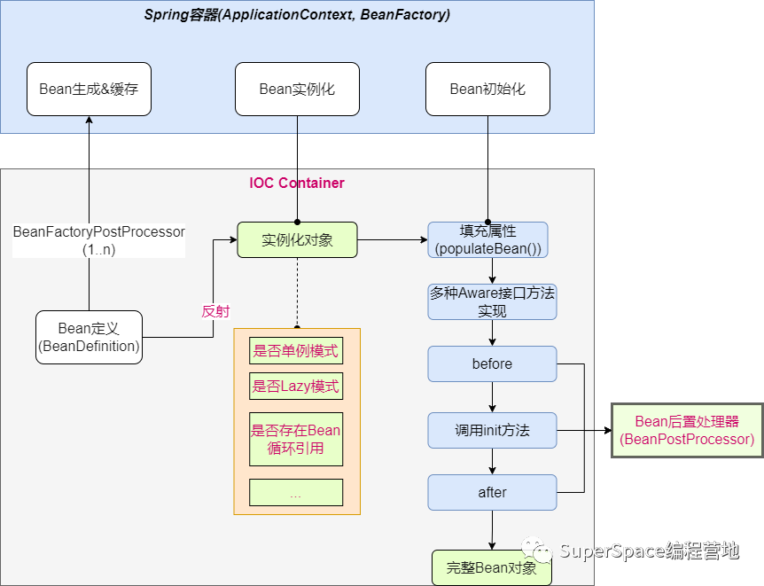
>
> **2.** **HOW****-Spring 生命周期怎样实现的？**
>
> _2.1 梳理 Bean 管理的流程顺序_
>
> 0) 做准备工作；
>
> 1) 创建 BeanFactory；
>
> 2) 加载配置文件并解析生成具体的 BeanDefinition，注册到 BeanFactory 中
>
> 3) 调用执行 BFPP(BeanFactoryPostProcessor)，确定最终的 BeanDefinition，且完成 BeanFactory 的某些修改工作；
>
> 4) 提前准备好初始化过程中使用的 BPP(BeanPostProcessor)；
>
> 5) 准备好监听器 (Listener)、多播器 (发布事件 Publisher), 准备使用观察者模式；
>
> 6) 实例化和初始化的执行逻辑。
>
> **汇总流程总结：**  
>
> 启动容器，实例化 ApplicationContext 实例，然后加载配置文件，然后实例化配置文件中声明的 bean。然后在实例 bean 的过程会先判断是否实现了这些 Aware 接口，如果实现了则会把相应的 Aware 资源注入。然后在相应的 bean 中就可以使用相应的 Aware 资源 mm,
>
> Spring 框架的容器是来管理所有的 Bean 的，通过配置文件可以声明容器，
>
> 原生的 Spring 配置可以通过在 classpath 目录下定义 spring-cfg.xml，例如：  
>
> ```
> <?xml version="1.0" encoding="UTF-8"?>
> <beans xmlns="http://www.springframework.org/schema/beans" 
> xmlns:context="http://www.springframework.org/schema/context" 
> xmlns:mvc="http://www.springframework.org/schema/mvc" 
> xmlns:xsi="http://www.w3.org/2001/XMLSchema-instance" 
> xsi:schemaLocation="http://www.springframework.org/schema/beans 
>       http://www.springframework.org/schema/beans/spring-beans-4.0.xsd 
>       http://www.springframework.org/schema/context 
>       http://www.springframework.org/schema/context/spring-context.xsd 
>       http://www.springframework.org/schema/mvc 
>       http://www.springframework.org/schema/mvc/spring-mvc-4.0.xsd">
>       <!-- 扫描包路径 -->
>       <context:component-scan base-package="com.superspace.spring"></context:component-scan>
> 
>       <!-- 自动注入 -->
>       <context:annotation-config></context:annotation-config>
> </beans> 
> ```
>
> 读取配置依赖注入 Bean 的代码 (当 getBean() 调用时即会注入 Bean 到容器中了, 当然若该 Bean 已在 Bean 缓存 Map 中则直接取出)：  
>
> ```
> ApplicationContext ctx = new ClassXmlApplicationContext("spring-cfg.xml");
> ctx.getBean("student");
> ```
>
> _2.2 Spring 生命周期相关源码分析_
>
> 1）容器初始化
>
> 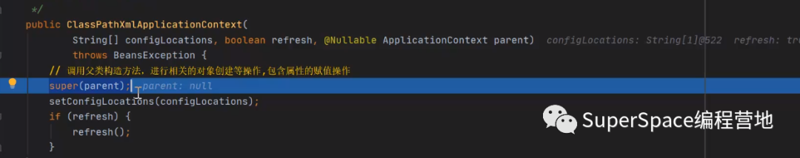
>
> 2）refresh() -- 最重要的方法 (没有之一)
>
> 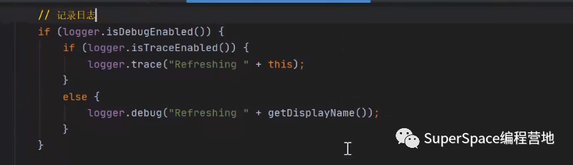
>
> 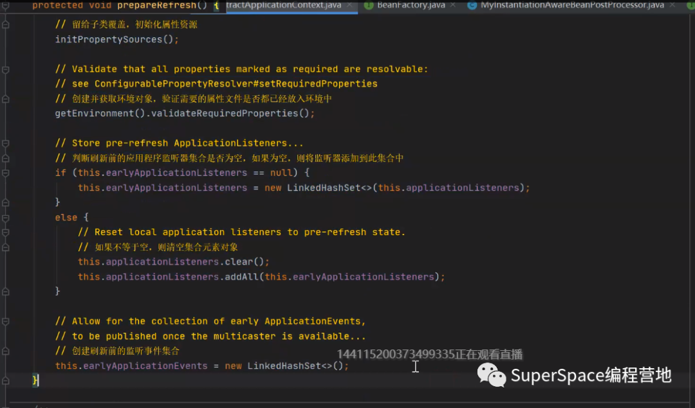
>
> 3）AbstractRefreshableApplicationContext:
>
> loadBeanDefinitions(): 完成当前 Bean 的加载工作形成 BeanDefinition。
>
> 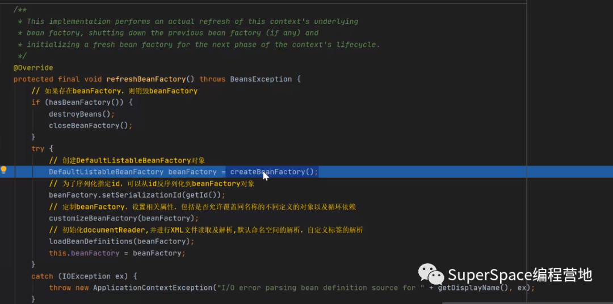
>
> 4）AbstractApplicationContext:
>
> 设置 beanFactory 的属性值：
>
> 
>
> 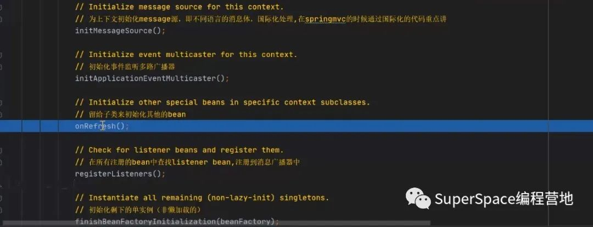
>
> 5）finishBeanFactoryInit: 通过反射完成实例化 --DefaultListableBeanFactory:beanFactory.pre..Singleton()
>
> 每次先从容器里 getBean() 一下，doGetBean() 实际执行的 -> createBean -> doCreateBean：
>
> 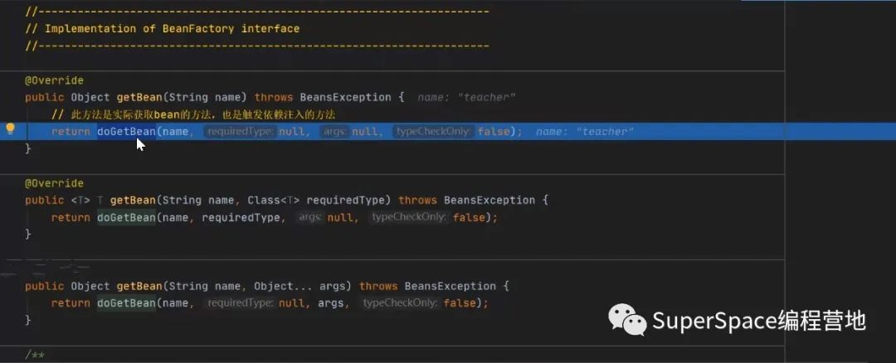
>
> 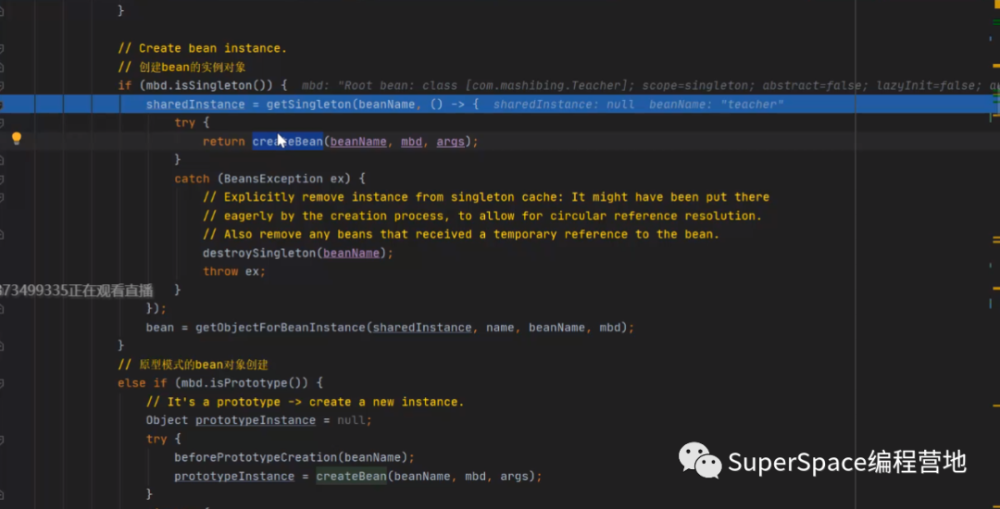
>
> 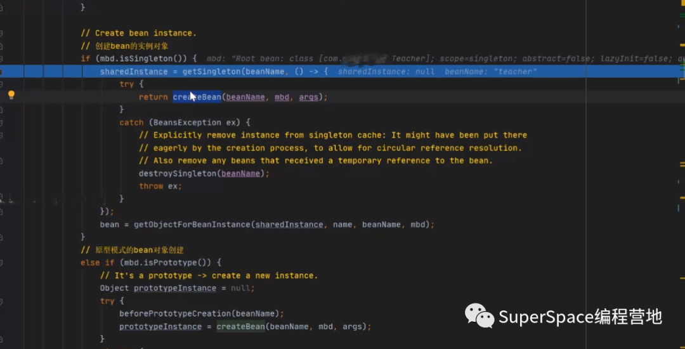
>
> 6）populateBean() 完成属性赋值：
>
> 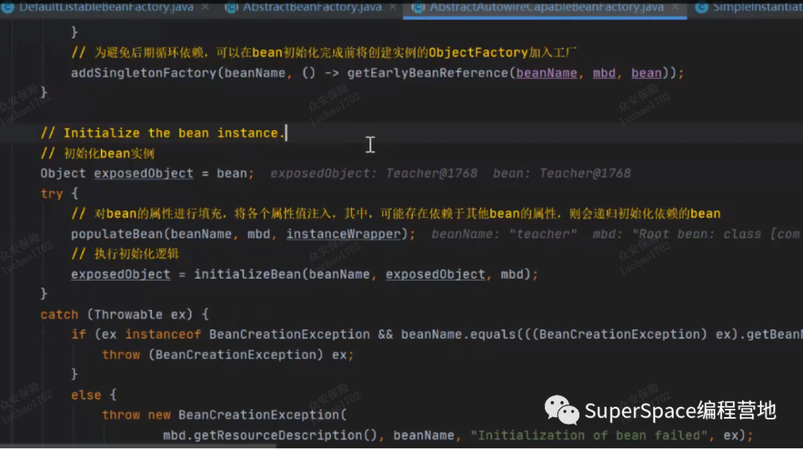
>
> 7）执行 beforePostProcessor、init 和 after..：
>
> 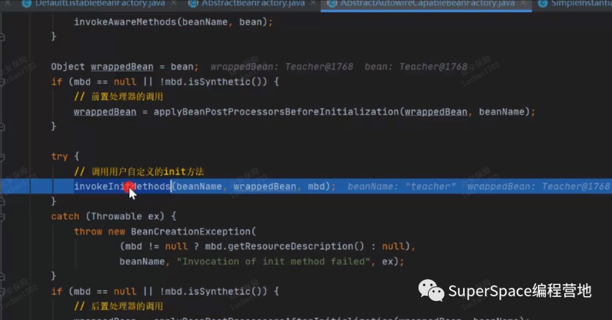
>
> **3 常用总结**  
>
> 3.1 手动 Bean 操作  
>
> 常常需要在代码中手动操作 Bean，这里提供工具类大家使用：
>
> ```
> package com.sp.spring.util;
> 
> import org.slf4j.Logger;
> import org.slf4j.LoggerFactory;
> import org.springframework.beans.factory.NoSuchBeanDefinitionException;
> import org.springframework.context.ApplicationContext;
> import org.springframework.context.ApplicationContextAware;
> import org.springframework.stereotype.Component;
> 
> import java.util.Map;
> 
> @Component
> public class SpringApplicationContextUtil implements ApplicationContextAware {
>   public static final String ERR_MSG_1 = "getBean异常";
>   private static final Logger logger = LoggerFactory.getLogger(SpringApplicationContextUtil.class);
>   public static final String ERR_MSG = "getAliases异常";
>   private static ApplicationContext applicationContext;
>   private static Map<String, Object> dispatcherObject;// 通过groovy脚本初始进来的对象
> 
>   public static void setDispatcherObject(Map<String, Object> dispatcherObject) {
>     SpringApplicationContextUtil.dispatcherObject = dispatcherObject;
>   }
> 
>   public ApplicationContext getApplicationContext() {
>     return SpringApplicationContextUtil.applicationContext;
>   }
>   @Override
>   public void setApplicationContext(ApplicationContext applicationContext) {
>     SpringApplicationContextUtil.applicationContext = applicationContext;//NOSONAR
>   }
> 
>   public static void addDispatcher(String name, Object obj) {
>     dispatcherObject.put(name, obj);
>   }
> 
>   /**
>    * 通过工厂类获取对应的服务
>    * 
>    * @param name
>    *            服务类名
>    * @return 服务类
>    */
>   public static Object getBean(String name) {
>     Object object = null;
>     try {
>       object = SpringApplicationContextUtil.applicationContext
>           .getBean(name);
>     } catch (Exception e) {
>       logger.error(ERR_MSG_1, e);
>     }
>     return object;
>   }
> 
>   /**
>    * 通过类型获取
>    * 
>    * @param requiredType
>    * @return
>    */
>   public static <T> T getBean(Class<T> requiredType) {
>     T object = null;
>     try {
>       object = SpringApplicationContextUtil.applicationContext
>           .getBean(requiredType);
>     } catch (Exception e) {
>       logger.error(ERR_MSG_1, e);
>     }
>     return object;
>   }
> 
> 
>   /**
>    * 获取指定class类型的服务类
>    * 
>    * @param name
>    *            名称
>    * @param requiredType
>    *            class对象
>    * @return 服务类
>    */
>   @SuppressWarnings({ "unchecked", "rawtypes" })
>   public static Object getBean(String name, Class requiredType) {
>     Object object = null;
>     try {
>       object = SpringApplicationContextUtil.applicationContext.getBean(
>           name, requiredType);
>     } catch (NoSuchBeanDefinitionException e) {
>       logger.error(ERR_MSG_1, e);
>     }
>     return object;
>   }
> 
>   /**
>    * 是否存在执行名称的服务类
>    * 
>    * @param name
>    *            名称
>    * @return true 存在 flase 不存在
>    */
>   public static boolean containsBean(String name) {
>     return SpringApplicationContextUtil.applicationContext
>         .containsBean(name);
>   }
> 
>   /**
>    * 获取注册class类型
>    * 
>    * @param name
>    * @return
>    */
>   public static String[] getAliases(String name) {
>     String[] s = null;
>     try {
>       s = SpringApplicationContextUtil.applicationContext
>           .getAliases(name);
>     } catch (NoSuchBeanDefinitionException e) {
>       logger.error(ERR_MSG, e);
>     }
>     return s;
>   }
> }
> ```
>
> 3.2 获取容器对象  
>
> 即实现 Aware 接口方法：  
>
> 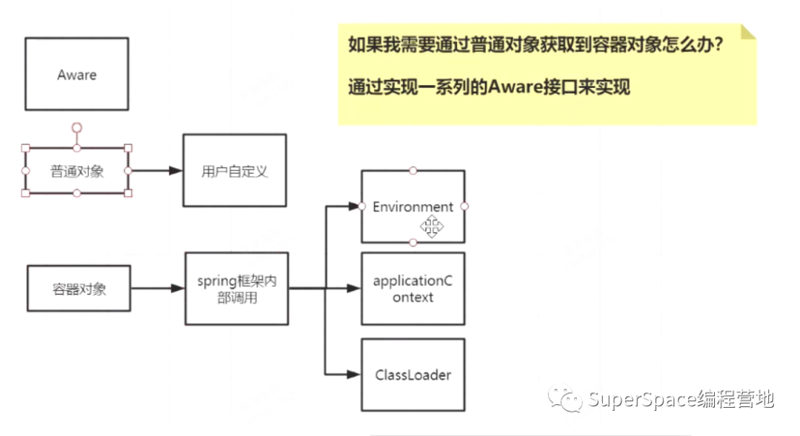
>
> 好了，Spring 框架的生命周期就讲这么多了，欢迎大家留言讨论持续补充。
